# 🗄️ Bar-Restaurant Application - Database Relational Diagram

## Entity-Relationship Diagram

This diagram shows all database entities and their relationships based on `entities.md`.

```mermaid
erDiagram
    %% Core Entities
    Tables ||--o{ Orders : "has"
    Tables ||--o{ Request_Notifications : "has"
    Tables ||--o{ Karaoke_Song_Requests : "has"
    Tables ||--o{ Table_Sessions : "has"
    Tables ||--o{ Reservations : "has" 
    
    Customers ||--o{ Orders : "places"
    Customers ||--o{ Customer_Favorites : "has"
    Customers ||--o{ Loyalty_Points_Transactions : "has"
    Customers ||--o{ Reviews : "writes"
    
    Orders ||--o{ Order_Items : "contains"
    Orders ||--o{ Payments : "has"
    Orders ||--|| Invoices_Customer : "generates"
    Orders }o--|| Promotions : "applies"
    Orders ||--o{ Loyalty_Points_Transactions : "generates"
    
    Order_Items }o--|| Menu_Items : "references"
    
    Menu_Categories ||--o{ Sub_Menus : "contains"
    Sub_Menus ||--o{ Menu_Items : "contains"
    Menu_Items ||--o{ Ingredients : "uses"
    Menu_Items ||--o{ Customer_Favorites : "favorited_by"
    Menu_Items ||--o{ Reviews : "reviewed"
    
    Ingredients }o--|| Stock_Items : "references"
    
    Stock_Items }o--|| Stock_Item_Categories : "belongs_to"
    Stock_Items ||--o{ Ingredients : "used_in"
    Stock_Items ||--o{ Existences : "has"
    Stock_Items ||--o{ Invoice_Details : "purchased_as"
    
    Stock_Item_Categories ||--o{ Stock_Items : "categorizes"
    
    Suppliers ||--o{ Invoices_Purchase : "supplies"
    
    Invoices_Purchase ||--o{ Invoice_Details : "contains"
    
    Invoice_Details ||--o{ Existences : "creates"
    
    Payments }o--|| Staff : "processed_by"
    Payments }o--|| Invoices_Customer : "generates"
    
    Staff ||--o{ Payments : "processes"
    Staff ||--o{ Table_Sessions : "clears"
    Staff ||--o{ Request_Notifications : "handles"
    Staff ||--o{ Karaoke_Song_Requests : "manages"
    
    Promotions ||--o{ Orders : "applied_to"
    
    %% Entity Definitions
    Tables {
        uuid id PK
        varchar table_number UK
        int capacity
        enum status
        json floor_plan_position
        timestamp created_at
        timestamp updated_at
    }
    
    Customers {
        uuid id PK
        varchar customer_id UK
        varchar name
        varchar phone
        varchar email
        date date_of_birth
        int loyalty_points
        timestamp created_at
        timestamp updated_at
    }
    
    Orders {
        uuid id PK
        uuid table_id FK
        uuid customer_id FK
        varchar customer_name
        enum status
        enum payment_status
        timestamp payment_requested_at
        timestamp paid_at
        uuid promotion_id FK
        decimal total_amount
        decimal promotion_discount_amount
        decimal tax_amount
        decimal service_charge
        timestamp created_at
        timestamp updated_at
        timestamp confirmed_at
    }
    
    Order_Items {
        uuid id PK
        uuid order_id FK
        uuid menu_item_id FK
        int quantity
        decimal unit_price
        decimal subtotal
        enum status
        enum order_type
        text special_instructions
        varchar lost_reason
        enum fault_type
        decimal lost_cost
        timestamp requested_at
        timestamp preparing_at
        timestamp ready_at
        timestamp delivered_at
        timestamp lost_at
        timestamp created_at
        timestamp updated_at
    }
    
    Menu_Categories {
        uuid id PK
        varchar name UK
        int display_order
        text description
        timestamp created_at
        timestamp updated_at
    }
    
    Sub_Menus {
        uuid id PK
        varchar name
        text description
        uuid category_id FK
        varchar image_url
        enum item_type
        int display_order
        boolean is_active
        timestamp created_at
        timestamp updated_at
    }
    
    Menu_Items {
        uuid id PK
        varchar name
        text description
        uuid sub_menu_id FK
        decimal price
        decimal item_cost
        decimal happy_hour_price
        varchar image_url
        boolean is_available
        int preparation_time
        json menu_types
        json dietary_tags
        json allergens
        boolean is_alcoholic
        int display_order
        timestamp created_at
        timestamp updated_at
    }
    
    Stock_Items {
        uuid id PK
        varchar name UK
        varchar unit
        text description
        uuid stock_item_category_id FK
        timestamp created_at
        timestamp updated_at
    }
    
    Stock_Item_Categories {
        uuid id PK
        varchar name UK
        text description
        timestamp created_at
        timestamp updated_at
    }
    
    Ingredients {
        uuid id PK
        uuid menu_item_id FK
        uuid stock_item_id FK
        decimal quantity
        timestamp created_at
        timestamp updated_at
    }
    
    Suppliers {
        uuid id PK
        varchar name UK
        varchar contact_name
        varchar phone
        varchar email
        text address
        text notes
        timestamp created_at
        timestamp updated_at
    }
    
    Invoices_Purchase {
        uuid id PK
        varchar invoice_number UK
        uuid supplier_id FK
        date transaction_date
        decimal total_amount
        varchar image_url
        text notes
        timestamp created_at
        timestamp updated_at
    }
    
    Invoice_Details {
        uuid id PK
        uuid invoice_id FK
        uuid stock_item_id FK
        text detail
        decimal count
        varchar unit_type
        decimal price
        int items_per_unit
        decimal total
        date expiration_date
        timestamp created_at
        timestamp updated_at
    }
    
    Existences {
        uuid id PK
        int existence_reference_code UK
        uuid stock_item_id FK
        uuid invoice_detail_id FK
        decimal units_purchased
        decimal units_available
        varchar unit_type
        int items_per_unit
        decimal cost_per_item
        decimal cost_per_unit
        decimal total_purchase_cost
        decimal remaining_value
        date expiration_date
        decimal income_margin_percentage
        decimal income_margin_amount
        decimal minimum_price
        decimal maximum_price
        decimal final_price
        timestamp created_at
        timestamp updated_at
    }
    
    Customer_Favorites {
        uuid id PK
        uuid customer_id FK
        uuid menu_item_id FK
        timestamp created_at
    }
    
    Payments {
        uuid id PK
        uuid order_id FK
        decimal amount
        enum payment_method
        enum payment_status
        decimal exact_change_amount
        decimal cash_amount_provided
        decimal tip_amount
        uuid processed_by_staff_id FK
        varchar transaction_id
        timestamp processed_at
        timestamp created_at
        timestamp updated_at
    }
    
    Invoices_Customer {
        uuid id PK
        uuid order_id FK
        uuid payment_id FK
        varchar invoice_number UK
        enum invoice_type
        varchar customer_name
        varchar customer_tax_id
        decimal subtotal
        decimal tax_amount
        decimal service_charge
        decimal total_amount
        varchar payment_method
        text xml_data
        text digital_signature
        enum status
        timestamp generated_at
        timestamp created_at
        timestamp updated_at
    }
    
    Staff {
        uuid id PK
        varchar username UK
        varchar email UK
        varchar password_hash
        varchar first_name
        varchar last_name
        enum role
        boolean is_active
        timestamp last_login_at
        timestamp created_at
        timestamp updated_at
    }
    
    Request_Notifications {
        uuid id PK
        enum request_type
        uuid table_id FK
        uuid order_id FK
        varchar customer_name
        text message
        enum status
        uuid handled_by_staff_id FK
        timestamp handled_at
        timestamp created_at
        timestamp updated_at
    }
    
    Karaoke_Song_Requests {
        uuid id PK
        uuid table_id FK
        varchar customer_name
        varchar song_title
        varchar artist_name
        enum status
        int position_in_queue
        text skip_reason
        uuid skipped_by_staff_id FK
        timestamp started_at
        timestamp completed_at
        timestamp created_at
        timestamp updated_at
    }
    
    Karaoke_Song_Library {
        uuid id PK
        varchar song_title
        varchar artist_name
        int duration_estimate
        boolean is_available
        int popularity_count
        timestamp created_at
        timestamp updated_at
    }
    
    Loyalty_Points_Transactions {
        uuid id PK
        uuid customer_id FK
        uuid order_id FK
        enum transaction_type
        int points
        varchar description
        timestamp created_at
    }
    
    Table_Sessions {
        uuid id PK
        uuid table_id FK
        timestamp started_at
        timestamp ended_at
        uuid cleared_by_staff_id FK
        enum status
    }
    
    Reservations {
        uuid id PK
        uuid table_id FK
        uuid customer_id FK
        varchar customer_name
        varchar customer_phone
        date reservation_date
        time reservation_time
        int party_size
        enum status
        text special_requests
        timestamp created_at
        timestamp updated_at
    }
    
    Promotions {
        uuid id PK
        varchar name
        text description
        enum promotion_type
        enum discount_type
        decimal discount_value
        int points_required
        enum recurrence_type
        date start_date
        date end_date
        time from_time
        time to_time
        json days_of_week
        boolean is_active
        timestamp created_at
        timestamp updated_at
    }
    
    Reviews {
        uuid id PK
        uuid customer_id FK
        uuid order_id FK
        uuid menu_item_id FK
        int rating
        text comment
        boolean is_moderated
        boolean is_approved
        timestamp created_at
        timestamp updated_at
    }
```

## Legend

- **PK**: Primary Key
- **FK**: Foreign Key
- **UK**: Unique Key
- **||--o{**: One-to-Many relationship
- **}o--||**: Many-to-One relationship
- **||--||**: One-to-One relationship

## Service Ownership

| Service | Port | Entities |
|---------|------|----------|
| **menu-service** | 8088 | Menu_Categories, Sub_Menus, Menu_Items |
| **inventory-service** | 8090 | Stock_Items, Stock_Item_Categories, Suppliers, Existences, Ingredients |
| **invoice-service** | 8092 | Invoices_Purchase, Invoice_Details, Invoices_Customer |
| **orders-service** | 8089 | Tables, Orders, Order_Items, Payments, Request_Notifications, Table_Sessions |
| **customer-service** | 8095 | Customers, Customer_Favorites, Loyalty_Points_Transactions, Reviews |
| **karaoke-service** | 8093 | Karaoke_Song_Requests, Karaoke_Song_Library |
| **promotion-service** | 8094 | Promotions, Reservations |
| **session-service** | 8087 | Staff |

## Key Relationships

1. **Orders** (orders-service):
   - Linked to Tables, Customers (cross-service), Promotions (cross-service)
   - Contains Order Items
   - Generates Payments and Customer Invoices (cross-service)
   - Can generate Loyalty Points Transactions (cross-service)

2. **Menu Hierarchy** (menu-service):
   - Menu Categories → Sub Menus → Menu Items
   - Example: Drinks → Smoothies → Banana Smoothie
   - `item_type` (kitchen/bar) is defined at Sub Menu level
   - Pricing at Menu Item level, ingredients via inventory-service API

3. **Inventory System** (inventory-service):
   - Stock Items → Ingredients → Menu Items (cross-service)
   - Existences track inventory levels and costs
   - invoice-service calls API to create existences from purchases

4. **Invoice System** (invoice-service):
   - Purchase Invoices: Suppliers → Invoices_Purchase → Invoice_Details
   - Customer Invoices: Orders (cross-service) → Invoices_Customer

5. **Customer System** (customer-service):
   - Customers can have Orders (cross-service), Favorites, Loyalty Points, Reviews
   - Customer record only created when opting into loyalty program

6. **Promotions** (promotion-service):
   - Applied to Orders (one promotion per order, cross-service)
   - Time-based promotions apply to all orders
   - Customer-specific promotions require eligibility checks

7. **Staff Management** (session-service):
   - Staff process Payments, handle Requests, manage Karaoke, clear Table Sessions

---

**Note**: This diagram uses Mermaid syntax and can be rendered in:
- GitHub/GitLab markdown files
- VS Code with Mermaid extension
- Many documentation tools (Confluence, Notion, etc.)
- Online Mermaid editors (mermaid.live)

